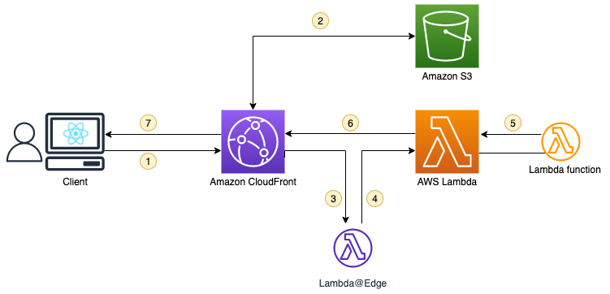
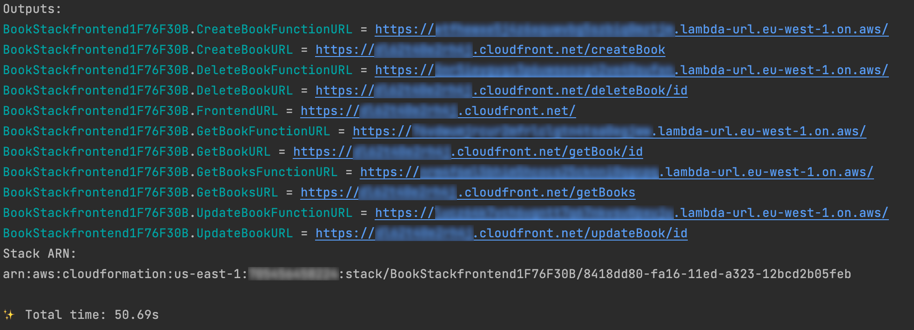

# Protecting a Lambda Function URL with Amazon CloudFront and Lambda@Edge

This repository is provided in support to an AWS blog post: [Protecting a Lambda Function URL with Amazon CloudFront and Lambda@Edge](https://aws.amazon.com/blogs/compute/protecting-an-aws-lambda-function-url-with-amazon-cloudfront-and-lambdaedge/)

## Overview

### Architecture

The solution is based on the following architecture:



More details can be found in the blog post.

### Structure of the solution

This repository contains 3 main components, available in the src folder:
- The frontend, a single page web application built with React and CloudScape.
- The AWS Lambda functions code. The application is a simple CRUD around books.
- The infrastructure code, provided as AWS CDK.

## Pre-requisites

To deploy this solution you need the following pre-requisites:

- An AWS Account.
- The AWS Command Line Interface (CLI) installed and configured for use. Refer this link to install the CLI. https://aws.amazon.com/cli/ 

  The user profile used to implement this reference solution should have enough privileges to create the following resources: 
    - IAM roles and policies
    - Lambda function and function url
    - Cloudfront Distribution & Lambda@Edge function
    - Systems Manager parameters

- Node JS is installed ( pre-requisite to install AWS CDK ). Download Node JS from here: https://nodejs.org/en/download/

- The AWS CDK V2 is installed. Refer this link to install AWS CDK V2: https://docs.aws.amazon.com/cdk/v2/guide/getting_started.html#getting_started_install

- If you've never deployed a solution with CDK, the AWS account must be bootstrapped (more info here: https://docs.aws.amazon.com/cdk/v2/guide/bootstrapping.html). 
Execute the following command to create the necessary AWS resources (S3 bucket, IAM role/s, etc...) that CDK will use to provision AWS resources for the solution.
Replace ACCOUNT-NUMBER and REGION with your account and region where you wish to deploy the solution:
```shell
$ cdk bootstrap aws://ACCOUNT-NUMBER/REGION
```

## Deployment
1. Clone the current repository
2. Execute the following commands:

```shell
$ cd lambda-function-url-lambda-edge
$ npm install
$ cdk deploy --all
```

Note: the deployment can take up to 15 minutes to finish

3. Once the deployment is successful, you should have several URLs in the output of CDK:

4. You can test the deployed solution by using the frontend. URL is available in the `FrontendURL` in CDK outputs.

## Clean-up
To remove the deployed resources from your AWS account:
1. You must first remove the replicas of the Lambda@Edge function. Refer to https://docs.aws.amazon.com/AmazonCloudFront/latest/DeveloperGuide/lambda-edge-delete-replicas.html
2. Execute the following command:
```shell
$ cdk destroy --all
```

## License
See [License](LICENSE) of the project.